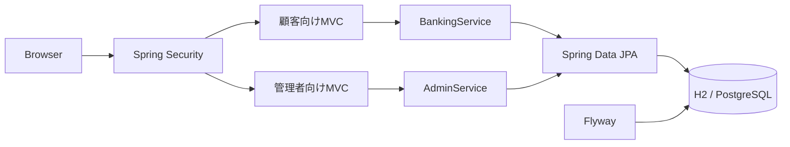
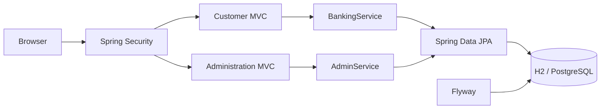

# Learning Bank — はと銀行

[日本語](#日本語) | [English](#english)

## 日本語

金融アプリケーションの基本的な設計、認証、トランザクション制御を学ぶためのインターネットバンキング・デモです。日本の銀行をモデルにしていますが、実在する金融機関やサービスとは関係ありません。実際の資金・個人情報には使用できません。

このプロジェクトは、一般的な銀行機能の要件から独立して新規実装されています。

### 機能

- フォームログインとBCryptパスワード
- 所有口座の一覧・残高照会
- 入金・出金・口座間振込
- 取引履歴
- 管理者専用ダッシュボード
- 顧客検索・登録・連絡先・利用状態管理
- 普通預金・貯蓄預金の口座開設
- 口座の利用中・凍結・解約状態管理
- 所有権チェック、残高チェック、CSRF対策
- 悲観ロックとDBトランザクションによる残高更新
- Flywayによるスキーマ管理
- H2およびPostgreSQL対応

### 起動

必要環境はJava 21以上です。Maven Wrapperを同梱しています。

```bash
./mvnw spring-boot:run -Dspring-boot.run.profiles=demo
```

`http://localhost:8080`を開きます。

| 用途 | ユーザーID | パスワード |
| --- | --- | --- |
| 顧客画面 | `alice` | `demo-pass` |
| 管理画面 | `admin` | `admin-pass` |

管理画面は`http://localhost:8080/admin`です。管理者と顧客はSpring Securityのロールで分離されています。Bobの振込先デモ口座は`1200013`です。標準設定ではデータを`./data`に保存します。固定のデモユーザーは`demo`プロファイルでのみ作成されます。PostgreSQLでデモデータを使用する場合は`postgres,demo`を明示的に有効にしてください。

デモ銀行は「はと銀行」（学習用デモ銀行コード`9999`）です。実在する金融機関のコードではありません。支店コードは3桁です。口座番号は支店・科目別に自動採番し、科目番号帯1桁、店別・科目別連番5桁、Luhn（Mod 10）方式のチェックデジット1桁を合わせた7桁で表現します。普通預金は1番帯、貯蓄預金は2番帯で、採番済み番号は再使用しません。

### アーキテクチャ



### 公開前の注意

これは学習用MVPです。本番の金融サービスに必要な本人確認、監査ログ、二要素認証、不正検知、振込承認、レート制限、秘密情報管理、障害復旧などは実装していません。

---

## English

Learning Bank is an internet banking demo for studying the fundamentals of financial application design, authentication, and transactional consistency. It is modeled after Japanese banks, but it is not affiliated with any real financial institution or service. It must not be used with real funds or personal information.

This project is an independent implementation based on general banking requirements.

### Features

- Form-based login with BCrypt password hashing
- Account list and balance inquiry
- Deposits, withdrawals, and account-to-account transfers
- Transaction history
- Administrator dashboard
- Customer search, registration, contact details, and status management
- Ordinary and savings account opening
- Active, frozen, and closed account status management
- Account ownership and balance validation, with CSRF protection
- Pessimistic locking and database transactions for balance updates
- Flyway database migrations
- H2 and PostgreSQL support

### Running the Application

Java 21 or later is required. The Maven Wrapper is included.

```bash
./mvnw spring-boot:run -Dspring-boot.run.profiles=demo
```

Open `http://localhost:8080`.

| Purpose | User ID | Password |
| --- | --- | --- |
| Customer portal | `alice` | `demo-pass` |
| Administration portal | `admin` | `admin-pass` |

The administration portal is available at `http://localhost:8080/admin`. Customer and administrator access is separated by Spring Security roles. Bob's demo destination account number is `1200013`. With the default configuration, data is stored under `./data`. Fixed demo users are created only when the `demo` profile is active. To use demo data with PostgreSQL, explicitly activate the `postgres,demo` profiles.

The demo institution is Hato Bank, with the educational demo bank code `9999`; it is not the code of a real financial institution. Branch codes contain three digits. Seven-digit account numbers are issued automatically for each branch and account category. They consist of a one-digit product range, a five-digit branch/product sequence, and a Luhn (Mod 10) check digit. Ordinary accounts use the `1` range, savings accounts use the `2` range, and issued numbers are never reused.

### Architecture



### Production Readiness Notice

This is an educational MVP. It does not implement production banking requirements such as identity verification, audit logging, multi-factor authentication, fraud detection, transfer approval workflows, rate limiting, secrets management, or disaster recovery.

## License

MIT License. Third-party dependencies remain subject to their respective licenses.
