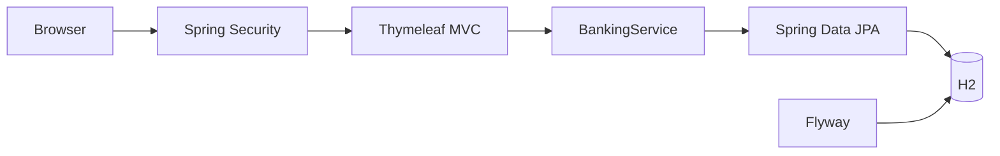

# Learning Bank

金融アプリケーションの基本的な設計、認証、トランザクション制御を学ぶためのインターネットバンキング・デモです。実在する金融機関やサービスとは関係なく、実際の資金・個人情報には使用できません。

このプロジェクトは、一般的な銀行機能の要件から独立して新規実装されています。同じリポジトリに置かれた出所不明の旧サンプルコードや、そのUI・文章・素材・生成コードは含んでいません。

## 機能

- フォームログインとBCryptパスワード
- 所有口座の一覧・残高照会
- 入金・出金・口座間振込
- 取引履歴
- 所有権チェック、残高チェック、CSRF対策
- 悲観ロックとDBトランザクションによる残高更新
- Flywayによるスキーマ管理

## 起動

必要環境はJava 21以上です。Maven Wrapperを同梱しています。

```bash
./mvnw spring-boot:run
```

`http://localhost:8080` を開き、`alice` / `demo-pass` でログインします。Bobの振込先デモ口座は `2000001` です。データは `./data` に保存されます。

デモ銀行は「はと銀行」（銀行コード `201`）、本店（支店コード `001`）です。口座番号は7桁で表現します。

## アーキテクチャ



## 公開前の注意

これは学習用MVPです。本番の金融サービスに必要な本人確認、監査ログ、二要素認証、不正検知、振込承認、レート制限、秘密情報管理、障害復旧などは実装していません。

## License

MIT License。第三者依存ライブラリには、それぞれのライセンスが適用されます。
